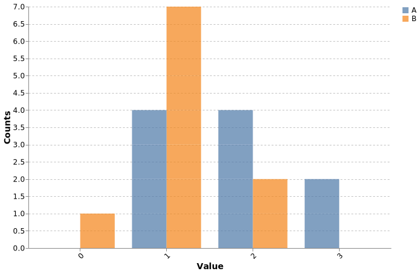

# Plot utils


A collection of high-level utility functions to facilitate plotting with Altair and Polars.

## Installation

```bash
pip install plotutils
```

## Functions

### `plot_confidence_scatter`

Create scatter plots with error bars. Aggregates raw data automatically using Altair's native `mark_errorbar`.

```python
import polars as pl
from plotutils.uncertainty import plot_confidence_scatter

df = pl.DataFrame({
    "x": [1.0] * 10 + [2.0] * 10 + [3.0] * 10,
    "y": [1.0, 0.8, 1.2, ...],  # multiple samples per x
})

chart = plot_confidence_scatter(
    df,
    x_labels={1.0: "Low", 2.0: "Medium", 3.0: "High"},
)
```

#### With numeric x-axis and custom labels


#### With identity line


#### Basic categorical x-axis


### `plot_grouped_histogram`

Create overlapping histograms for multiple groups.

```python
import polars as pl
from plotutils.hist import plot_grouped_histogram

# From dict
chart = plot_grouped_histogram(
    data={
        "Group A": [1.2, 2.3, 1.5, 3.1, 2.8],
        "Group B": [0.8, 1.5, 1.2, 2.1, 1.8],
    },
    n_bins=30,
    x_title="Value",
    y_title="Counts",
)

# Or from DataFrame
df = pl.DataFrame({
    "value": [1.2, 2.3, 1.5, 0.8, 1.5, 1.2],
    "group": ["A", "A", "A", "B", "B", "B"],
})
chart = plot_grouped_histogram(
    data=df,
    value_column="value",
    group_column="group",
)
```

#### Grouped histogram example



## Development

```bash
# Install dependencies
uv sync --group dev
uv pip install -e .

# Run tests
just test

# Run tests with coverage
just coverage

# Update snapshots and generate badge
just deploy
```
