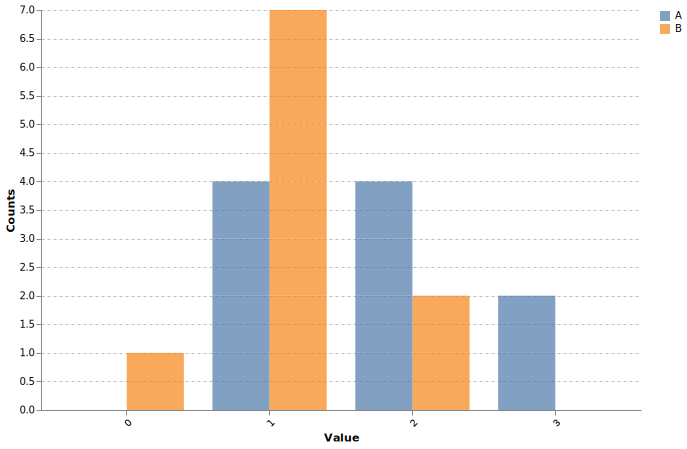

# Grouped Histogram

Create overlapping histograms for multiple groups.

## Example

```python
import polars as pl
from plotutils.hist import plot_grouped_histogram

# From dict
chart = plot_grouped_histogram(
    data={
        "Group A": [1.2, 2.3, 1.5, 3.1, 2.8],
        "Group B": [0.8, 1.5, 1.2, 2.1, 1.8],
    },
    n_bins=30,
    x_title="Value",
    y_title="Counts",
)

# Or from DataFrame
df = pl.DataFrame({
    "value": [1.2, 2.3, 1.5, 0.8, 1.5, 1.2],
    "group": ["A", "A", "A", "B", "B", "B"],
})
chart = plot_grouped_histogram(
    data=df,
    value_column="value",
    group_column="group",
)
```




## Reference

::: plotutils.hist.plot_grouped_histogram
